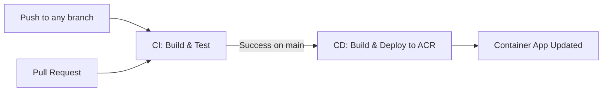

# Azure Project - TP Chat

Containerized application with CI/CD pipeline for Azure Container Registry (ACR) and Azure Container Apps deployment.
## Security & Observabilité

- **CI scans**: workflow ajouté dans `.github/workflows/security-scans.yml` — Trivy (scan d'image) + OWASP ZAP (DAST) sur PRs/pushes.
- **Scan local (Trivy)**:

```bash
# reconstruire l'image locale
docker compose build
docker build -t ghci-image:latest -f Docker .
# lancer Trivy contre l'image
docker run --rm -v /var/run/docker.sock:/var/run/docker.sock aquasec/trivy:latest image --severity HIGH,CRITICAL --exit-code 1 ghci-image:latest
```

```bash
docker run --rm -v $(pwd):/zap/wrk/:rw owasp/zap2docker-stable zap-baseline.py -t http://localhost:3000 -r zap_report.html
```

- **Observabilité**: `terraform/monitoring.tf` ajoute un `helm_release` pour `kube-prometheus-stack` (Prometheus + Grafana).
- **Docs**: `SECURITY.md` et `docs/security.md` ajoutés (instructions et reproduction locale).

---

## Architecture

- **Runtime**: Node.js on Alpine Linux
- **Web Server**: Nginx
- **Build Tool**: Bun
- **Container Registry**: Azure Container Registry (ACR)
- **CI/CD**: GitHub Actions
- **Orchestration**: Azure Container Apps (Managed Kubernetes)
- **Infrastructure**: Azure CLI

---

## Azure Infrastructure

# Azure Project - TP Chat

Containerized application with CI/CD pipeline for Azure Container Registry (ACR) and Azure Container Apps deployment.

## Security & Observabilité

- **CI scans**: workflow ajouté dans `.github/workflows/security-scans.yml` — Trivy (scan d'image) + OWASP ZAP (DAST) sur PRs/pushes.
- **Scan local (Trivy)**:

```bash
# reconstruire l'image locale
docker compose build
docker build -t ghci-image:latest -f Docker .
# lancer Trivy contre l'image
docker run --rm -v /var/run/docker.sock:/var/run/docker.sock aquasec/trivy:latest image --severity HIGH,CRITICAL --exit-code 1 ghci-image:latest
```

- **DAST local (OWASP ZAP)**:

```bash
docker run --rm -v $(pwd):/zap/wrk/:rw owasp/zap2docker-stable zap-baseline.py -t http://localhost:3000 -r zap_report.html
```

- **Observabilité**: `terraform/monitoring.tf` ajoute un `helm_release` pour `kube-prometheus-stack` (Prometheus + Grafana).
- **Docs**: `SECURITY.md` et `docs/security.md` ajoutés (instructions et reproduction locale).

---

## Architecture

- **Runtime**: Node.js on Alpine Linux
- **Web Server**: Nginx
- **Build Tool**: Bun
- **Container Registry**: Azure Container Registry (ACR)
- **CI/CD**: GitHub Actions
- **Orchestration**: Azure Container Apps (Managed Kubernetes)
- **Infrastructure**: Azure CLI

---

## Azure Infrastructure

| Resource | Name | Region |
|----------|------|--------|
| Resource Group | `rg-tp-chat` | `francecentral` |
| Log Analytics Workspace | `workspace-rgtpchatCfD0` | `francecentral` |
| Container Apps Environment | `env-tp-chat` | `francecentral` |
| Container Registry (ACR) | `tpchatimages.azurecr.io` | `francecentral` |
| Container App (test) | `tp-chat-test` | `francecentral` |

Test App URL: https://tp-chat-test.yellowsmoke-11c1ae9a.francecentral.azurecontainerapps.io/

---

## Docker Commands

```bash
# Build the image
docker compose build

# Start the application
docker compose up -d

# Stop the application
docker compose down

# View logs
docker compose logs -f

# Rebuild and restart
docker compose up -d --build
```

### Push to ACR

```bash
# Login to ACR
az acr login --name tpchatimages

# Tag and push
docker tag azure-project:latest tpchatimages.azurecr.io/tp-chat:latest
docker push tpchatimages.azurecr.io/tp-chat:latest
```

---

## Azure Container Apps Management

```bash
# View container app details
az containerapp show --name tp-chat-test --resource-group rg-tp-chat

# View logs
az containerapp logs show --name tp-chat-test --resource-group rg-tp-chat --follow

# Scale the app
az containerapp update --name tp-chat-test --resource-group rg-tp-chat --min-replicas 2 --max-replicas 5

# Get app URL
az containerapp show -n tp-chat-test -g rg-tp-chat --query properties.configuration.ingress.fqdn -o tsv

# Update image
az containerapp update --name tp-chat-test --resource-group rg-tp-chat --image tpchatimages.azurecr.io/tp-chat:<tag>
```

---

## Project Structure

```
azure-project/
├── .github/workflows/
│   ├── ci.yml              # Continuous Integration
│   └── cd.yml              # Continuous Deployment
├── Docker                  # Dockerfile
├── docker-compose.yml      # Local development
└── README.md
```

---

## CI/CD Pipeline

### Workflow



### Triggers

| Workflow | Trigger | Condition |
|----------|---------|-----------|
| CI (`ci.yml`) | Push to any branch | Always |
| CI (`ci.yml`) | Pull Request | Always |
| CD (`cd.yml`) | CI workflow completes | Only if CI succeeded on `main` |
| CD (`cd.yml`) | Manual `workflow_dispatch` | Emergency deployments |

---

## Quick Reference

| Task | Command |
|------|---------|
| Login to Azure | `az login` |
| Login to ACR | `az acr login --name tpchatimages` |
| Build image | `docker compose build` |
| Start app | `docker compose up -d` |
| Push to ACR | `docker tag azure-project:latest tpchatimages.azurecr.io/tp-chat:latest && docker push tpchatimages.azurecr.io/tp-chat:latest` |
| View container logs | `az containerapp logs show --name tp-chat-test --resource-group rg-tp-chat --follow` |
| Update container app | `az containerapp update --name tp-chat-test --resource-group rg-tp-chat --image tpchatimages.azurecr.io/tp-chat:<tag>` |

```
